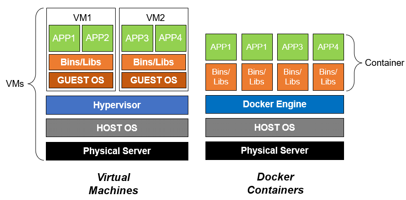
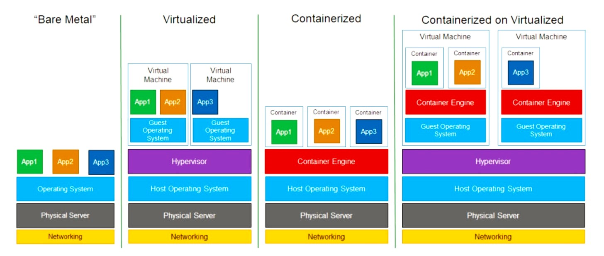
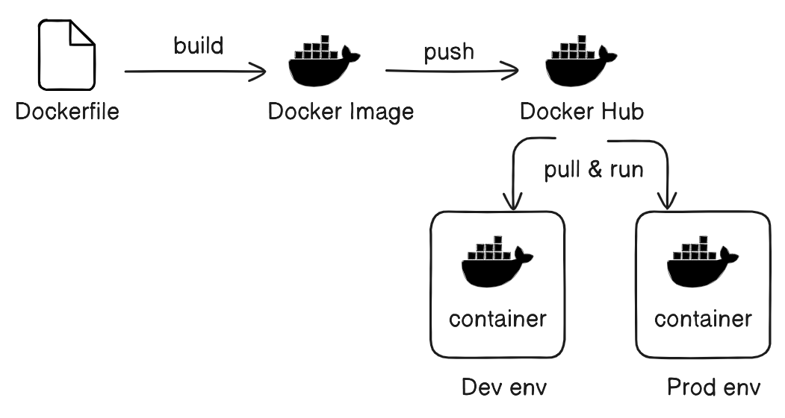
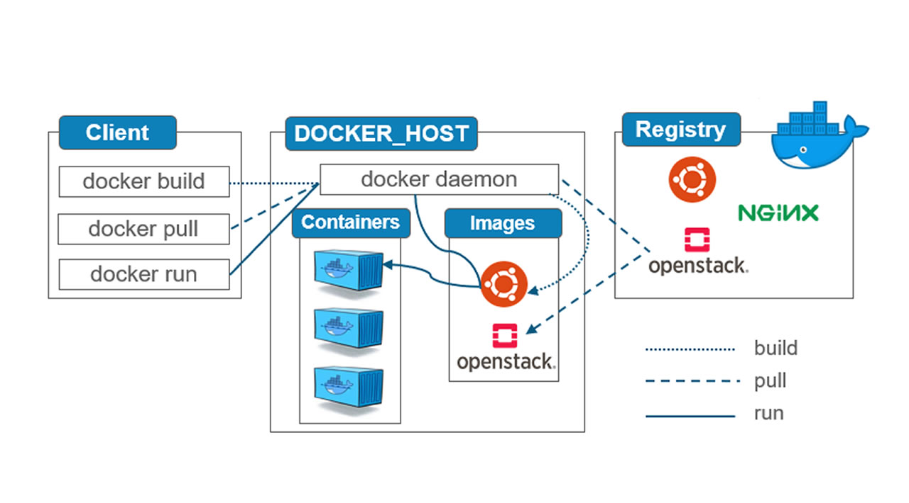

## Let's Start With Docker

### Why Container's?

#### Traditional way
Deployment's Working fine inside Dev, QA, UAT Environments but `Failed` inside Prod Environment

reason? 
- Environment misconfiguration
- missing depenedencies
- some extra libraries but prod is strictly restricted

if we want to make any changes in PROD we need to raise CR(change request) Process (get all approvals)

#### Container's way
Pack all depenedencies, libraries, configuration, runtime, App Code and ship it to all Environments

Now it will pass in all Environments (Dev, QA, UAT, Prod)
- Docker will provide isolated environment
- Lightweight environment

### VM's-Container's




### Docker Flow


### Docker Architecture


#### Docker Build:
- Step 1: The user runs the docker build command. This command is issued to the Docker daemon.
- Step 2: The Docker daemon builds the Docker image using the Dockerfile. (Note: `dockerd` is the default Docker daemon.)
#### Storing the Image Locally:
- Step 3: The built image is stored locally in the Docker host (the VM where Docker is running).
#### Pushing the Image:
- Step 4: The user runs the docker push command.
- Step 5: The Docker daemon pushes the image from the local registry to an image registry (like Docker Hub, JFrog).
#### Pulling the Image:
- Step 6: The user runs the docker pull command.
- Step 7: The Docker daemon pulls the image from the registry to the desired environment.
#### Running the Container:
- Step 8: Once the image is pulled, the user runs the docker run command.
- Step 9: The Docker daemon instructs the container runtime, which then spins up the container.

### Hand's on with Docker

- Step 1: Download source code
    ```
    git clone https://github.com/docker/getting-started-app.git
    ```
- Step 2: cd getting-started-app
    ```
    cd getting-started-app/
    ```
- Step 3: Write Dockefile
    ```
    vi Dockerfile
    ```
    ```
    FROM node:18-alpine
    WORKDIR /app
    COPY . .
    RUN yarn install --production
    CMD ["node", "src/index.js"]
    EXPOSE 3000
    ```
- Step 4: Build Image
    ```
    docker build -t docker-todo .
    ```
- Step 5: Check Docker Images
    ```
    docker images

    REPOSITORY     TAG       IMAGE ID       CREATED          SIZE
    docker-todo    latest    6ca1422cd72f   18 seconds ago   220MB
    ```
- Step 6: Push to DockerHub
    1. create public repository on hub.docker.com
    2. login to Docker Hub via CLI

        ```
        docker login
        ```
        ```
        Username: naveen2809
        Password:

        Login Succeeded
        ```
    3. tag docker image as per tagging standards
        ```
        docker tag docker-todo naveen2809/docker-todo:v1
        ```
    4. push image to DockerHub
        ```
        docker push naveen2809/docker-todo:v1
        ```
- Step 7: Pull From DockerHub inside other Environment
    ```
    docker pull naveen2809/docker-todo:v1
    ```
- Step 8: Start Contianer
    ```
    docker run -itd -p 3000:3000 naveen2809/docker-todo:v1
    ```
- Step 9: Check logs of Container
    ```
    docker logs 34d2a9626640
    or
    docker logs laughing_yalow
    ```
- Step 10: Enter into Container
    ```
    docker exec -it 34d2a9626640 sh
    or
    docker exec -it laughing_yalow sh
    ```
    ```
    /app # ls
    README.md node_modules package.json spec src yarn.lock
    ```

#### Optimize Image Size?
- Multi Stage Docker Build (220 mb to 180mb)
```
vi Dockerfile
```
```
# Stage 1: Build Stage
FROM node:18-alpine AS build
WORKDIR /app
COPY package.json yarn.lock ./
RUN yarn install

# Stage 2: Deployment Stage
FROM node:18-alpine AS deployer
WORKDIR /app
COPY --from=build /app/node_modules ./node_modules
COPY . .
CMD ["node", "src/index.js"]
EXPOSE 3000
```
```
docker build -t docker-todo2 .
```
#### check docker images
```
docker images
```
#### Remove Docker Image
```
docker image rm docker-todo2
```
#### See running container's
```
docker ps
```
#### See stppped container's
```
docker ps -a
```
#### To view the content of Docker container
```
docker inspect docker-todo
```
